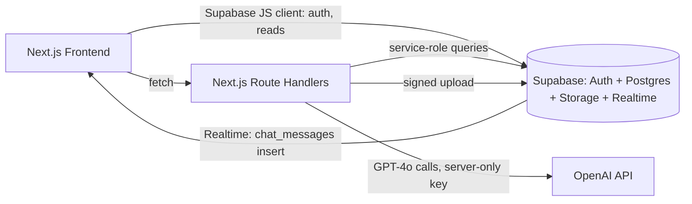

# ContractIQ — Engineering Document

**Status:** Draft — awaiting approval
**Source PRD:** `docs/ContractIQ_PRD.md` (v1.0, 2026-06-24)
**Prepared:** 2026-08-01

This document is the authoritative technical reference for ContractIQ. No implementation begins until this document and `implementation-specs.md` are approved.

---

## 1. Executive Summary

**Project:** ContractIQ — an AI-assisted contract review tool for Non-Disclosure Agreements (NDA) and Master Service Agreements (MSA).

**Business goal:** Let SMB founders, ops leads, procurement managers, and freelancers understand what they're signing without a lawyer on retainer, by automatically extracting the 10–17 key terms that matter for each contract type, showing exactly where each term lives (page + verbatim source sentence), how confident the extraction is, and letting the user ask follow-up questions grounded strictly in the uploaded document.

**Problem statement:** Manual contract review takes 90–120 minutes and requires legal expertise most SMBs don't have in-house. Generic AI chat tools produce unstructured summaries with no page reference, no confidence score, and no way to verify claims against the source text — leaving users unable to trust or audit the output.

**Target users:**
- **Primary:** Time-Pressed Founder / Ops Lead — 5–15 NDAs/MSAs signed per month, no in-house counsel, currently pays $250–$500/hr for ad-hoc legal review.
- **Secondary:** Freelancer / Consultant — receives 1–4 client MSAs per month, cannot afford legal review, signs under power imbalance without full understanding.

**Success criteria (MVP):**
| Metric | Target |
|---|---|
| Time from upload to completed review | ≤ 15 minutes (baseline: 90 min manual) |
| Key-term extraction F1 | ≥ 88% NDA / ≥ 85% MSA |
| Time to first extracted term displayed | ≤ 30s P95 (≤ 20-page contract) |
| Chat response latency | ≤ 15s P95 |
| Cost per contract analysis | ≤ $0.25 (extraction ≤ $0.20) |
| Correction rate (terms manually edited) | ≤ 12% |

---

## 2. Product Scope

### In Scope (MVP — through PRD roadmap v1.0)
- Email/password authentication (Supabase Auth)
- PDF upload (≤ 10 MB, ≤ 20 pages, ≤ 15,000 tokens) with contract-type selection (NDA / MSA)
- Server-side text extraction with `[PAGE N]` markers, stored once in the DB
- GPT-4o structured key-term extraction (standard term library per contract type) with confidence scoring and source-sentence attribution
- Up to 5 custom key terms per analysis, defined by the user before processing
- Results page: interactive PDF viewer (PDF.js) + key-terms panel, click-to-navigate between them
- Inline key-term correction, with original AI value preserved for the feedback loop
- Contract chat (Q&A) grounded strictly in the uploaded document, with mandatory page citations, persisted per contract
- Dashboard: contract history, totals by type, sortable list
- Thumbs up/down feedback with optional comment
- Rate limiting on OpenAI calls; retry-with-backoff on OpenAI failures
- WCAG 2.1 AA compliance; "not legal advice" disclaimer on every results page

### Out of Scope (MVP)
- Scanned / image-only PDFs (OCR) — graceful rejection only ("Scanned PDFs are not supported yet")
- Non-English contracts, non-US/UK governing law conventions
- Contract types other than NDA and MSA
- Export to CSV/PDF (deferred — see Phase 2)
- Batch upload, multi-contract comparison, team workspaces, email notifications (deferred — see Phase 2/3)
- Native mobile app

### Future Enhancements
- **Phase 2 (PRD v1.1):** CSV export, PDF summary export, batch upload (≤ 5 contracts), dashboard analytics (charts)
- **Phase 3 (PRD v1.2):** OCR for scanned PDFs, side-by-side contract comparison, email notifications on processing completion, multi-user team workspaces

---

## 3. User Personas

| Persona | Role | Permissions | Primary Workflow |
|---|---|---|---|
| Time-Pressed Founder / Ops Lead | Authenticated user (single role at MVP — no admin/team tiers) | Full access to own contracts, chat sessions, and feedback; no access to other users' data (enforced via RLS) | Upload contract → review extracted terms → verify low-confidence flags → chat for edge-case questions |
| Freelancer / Consultant | Authenticated user (same role) | Same as above | Upload client-sent MSA → check non-standard clauses → correct misread terms → export decision-relevant terms to share (Phase 2) |

There is a single application-level role at MVP (`authenticated user`). No admin console, no team/workspace roles — multi-user workspaces are explicitly deferred to v1.2 per the PRD roadmap. All authorization is data-level (row ownership via `user_id`), not role-based.

---

## 4. User Flows

Format: `User Action → Frontend Behavior → Backend Processing → Database Interaction → System Response`

### 4.1 Sign Up → Dashboard
1. User clicks "Get Started Free" on landing page → Frontend opens Supabase Auth sign-up form (email + password) → Supabase Auth creates the user record and session → no app DB write yet → Frontend redirects to `/dashboard`.
2. Dashboard loads → Frontend calls `GET /api/contracts` → Route Handler validates session, queries `contracts` filtered by `user_id` → Database returns empty set (new user) → Frontend renders empty state: "No contracts reviewed yet — upload your first contract to begin."

### 4.2 Sign In → Dashboard
1. User submits credentials → Frontend calls Supabase Auth `signInWithPassword` → Supabase validates and returns a session → Frontend stores session (Supabase client, httpOnly cookie via `@supabase/ssr`) → redirect to `/dashboard`.
2. Dashboard loads → Frontend fetches summary via `GET /api/contracts?summary=true` → Route Handler aggregates counts by type + last 5 contracts, scoped to `user_id` → Database returns rows → Frontend renders summary card + "Review a Contract" CTA.

### 4.3 Core Flow — Contract Review
1. **Upload:** User selects contract type (NDA/MSA), drags in a PDF → Frontend validates client-side (file type, ≤ 10 MB) → `POST /api/contracts` (multipart) → Route Handler re-validates size/type server-side, uploads the file to Supabase Storage (`contracts/{user_id}/{contract_id}/{filename}.pdf`, non-blocking — failure only disables the PDF viewer later), extracts text server-side (`pdf-parse`) inserting `[PAGE N]` markers, checks word count (< 100 words → reject as "Scanned PDFs are not supported yet"), checks token count (> 15,000 → reject) → inserts a `contracts` row (`status = 'uploaded'`, `contract_text` populated) → returns `contract_id` + a preview of standard terms for the selected type.
2. **Pre-processing preview:** Frontend renders the standard term list for the chosen type (client-side static list, matches PRD term library) while offering "+ Add Key Term" (up to 5 custom terms, held in Zustand local state, not yet persisted).
3. **Process trigger:** User clicks "Process Contract" → `POST /api/extract` with `contract_id` + custom term list → Route Handler sets `status = 'processing'`, builds the few-shot extraction prompt (contract type + `contract_text` + custom terms), calls OpenAI GPT-4o (JSON mode, temp 0.1, retry-with-backoff ×3) → parses JSON array of terms → validates each term against the expected schema, retries once on parse failure → inserts rows into `key_terms` (and `custom_key_terms` for user-added ones, `is_manual = true`) → sets `status = 'completed'` → returns the full term set.
4. **Results page:** Frontend fetches `GET /api/contracts/{id}` (contract + terms, via TanStack Query) → renders two-panel layout: PDF.js viewer (left, using a 1-hour signed URL, or the text-viewer fallback if Storage upload failed) + key-terms panel (right, colour-coded confidence).
5. **Manual correction:** User edits a term inline → `PATCH /api/terms/{id}` → Route Handler updates `key_terms.value`, sets `edited = true`, preserves `original_value` → writes a row to `term_corrections` → Database commits → Frontend shows "Edited" badge, TanStack Query invalidates and refetches.
6. **Chat:** Covered in 4.4.
7. **Low-confidence flag:** Any term with `confidence_score < 50` renders with a ⚠️ icon and non-dismissible tooltip; the PDF viewer auto-highlights the nearest matching page span on click.

### 4.4 Chat With Contract
1. User opens the Chat tab → Frontend fetches existing `chat_sessions`/`chat_messages` for the contract (creates a session on first message if none exists) → renders prior history.
2. User types a question → `POST /api/chat` with `session_id` + message text → Route Handler fetches full `contract_text`, full message history (ascending, ≤ 200 messages) → classifies the query (`contract` / `history` / `both`) to adjust the system prompt → calls OpenAI GPT-4o (temp 0.4, system prompt: "Answer only from the document text provided. If the answer is not in the document, say so.") → validates the response contains a `[Page X]` citation → inserts both the user message and assistant response into `chat_messages` (role, timestamp) → Database commits → Frontend renders the response, right-aligned user / left-aligned assistant, with the page citation as a clickable link that scrolls the PDF viewer.

---

## 5. Frontend Architecture

**Stack:** Next.js 14 (App Router), TypeScript, Tailwind CSS, PDF.js (`pdfjs-dist`), TanStack Query (server state), Zustand (local UI state), `@supabase/ssr` for session-aware Supabase client.

**State management (decision):**
- **TanStack Query** owns all server-derived state: contract lists, contract detail + key terms, chat message history. Handles caching, refetch-on-mutation invalidation, and polling during `status = 'processing'`.
- **Zustand** owns ephemeral local UI state that never touches the DB directly: upload-wizard step, in-progress custom-term drafts before submission, PDF viewer zoom/page state, chat input draft.
- Supabase Realtime is used only for chat message streaming (subscribing to `chat_messages` inserts for the active session) — the subscription pushes new rows into the TanStack Query cache rather than maintaining separate state.

**UX states (required for every data-bearing view):**
- **Loading:** Skeleton loaders for dashboard rows and the key-terms panel; a 3-step progress indicator (extracting text → analysing with AI → compiling results) during processing.
- **Empty:** Dashboard empty state on zero contracts; empty chat state ("Ask a question about this contract").
- **Error:** Upload rejection (size/page/token/scanned-PDF), OpenAI timeout/failure with a "Try again" CTA reading from `contracts.status = 'error'`, Storage-unavailable fallback (text viewer instead of PDF.js).
- **Responsive:** Two-panel results layout collapses to tabbed (PDF / Terms / Chat) below `768px`.
- **Accessibility:** WCAG 2.1 AA — all interactive elements keyboard-navigable, confidence colour-coding paired with icon + text (not colour alone), focus-visible states, ARIA labels on the PDF viewer controls and chat log (`aria-live` for new messages).

**Page / component hierarchy:**
```
app/
├── (marketing)/page.tsx                 # Landing page
├── (auth)/sign-in/page.tsx
├── (auth)/sign-up/page.tsx
├── (dashboard)/dashboard/page.tsx        # Summary + contract history
├── (dashboard)/upload/page.tsx           # Contract type + file picker + preview
├── (dashboard)/contracts/[id]/page.tsx   # Results page (PDF + terms + chat)
components/
├── upload/UploadDropzone.tsx
├── upload/TermPreviewList.tsx
├── upload/CustomTermInput.tsx
├── results/PdfViewer.tsx                 # PDF.js wrapper, targetPage prop
├── results/TextViewerFallback.tsx        # [PAGE N]-driven fallback
├── results/KeyTermsPanel.tsx
├── results/KeyTermRow.tsx                # value, page, confidence, edit
├── results/ConfidenceBadge.tsx
├── chat/ChatPanel.tsx
├── chat/ChatMessage.tsx
├── dashboard/ContractTable.tsx
├── dashboard/SummaryCards.tsx
├── shared/Disclaimer.tsx                 # "Not legal advice" banner
```

---

## 6. Backend Architecture

**Decision:** Backend logic lives in **Next.js Route Handlers** (`app/api/**/route.ts`), deployed as Netlify Functions alongside the frontend — a single codebase and deployment pipeline, rather than a separate Supabase Edge Functions runtime. This satisfies the PRD's requirement that the OpenAI API key is never exposed to the client (all OpenAI calls happen server-side in Route Handlers) while avoiding a second Deno runtime and deploy target.

**Core systems:**
- **Auth:** Supabase session validated on every Route Handler via `@supabase/ssr` server client reading the session cookie; unauthenticated requests return `401`.
- **Authorization:** Row-level — every query is scoped to `auth.uid()`, enforced twice (application query filters `user_id = session.user.id`, and Postgres RLS policies as the hard backstop).
- **Business logic:** Kept thin per PRD intent — Route Handlers orchestrate (validate → call Supabase / OpenAI → persist → respond); no business logic duplicated between routes and DB triggers beyond what's needed for data integrity (e.g., `updated_at` triggers).
- **Validation:** Zod schemas per route for request bodies; file validation (MIME type, size, page count via a lightweight PDF header check) before any extraction work begins.
- **Rate limiting:** DB-backed — a `rate_limits` table tracks `(user_id, window_start, request_count)` per OpenAI-calling route; Route Handlers check-and-increment atomically before calling OpenAI. Chosen over an external rate-limiting vendor (e.g. Upstash) to stay within the "single Supabase project" architecture the PRD specifies.
- **Retry/backoff:** A shared `lib/openai/withRetry.ts` wrapper retries OpenAI calls up to 3 times with exponential backoff; on final failure, sets `contracts.status = 'error'` and returns a human-readable error — never a silent failure.
- **Error handling:** Centralized error-response helper (`lib/api/errors.ts`) standardizes error shape (`{ error: { code, message } }`) across all routes.

**Service interaction diagram:**


---

## 7. Database Design and Schema

All tables live in a single Supabase (Postgres) project. Every table has a `user_id` FK and an RLS policy restricting access to `auth.uid() = user_id` (directly, or transitively via a parent contract for child tables).

### `contracts`
| Column | Type | Notes |
|---|---|---|
| `id` | uuid, PK, default `gen_random_uuid()` | |
| `user_id` | uuid, FK → `auth.users.id`, not null | RLS anchor |
| `contract_type` | text, check in `('nda','msa')`, not null | |
| `file_name` | text, not null | |
| `file_path` | text, nullable | Null if Storage upload failed (non-blocking) |
| `contract_text` | text, not null | Extracted text with `[PAGE N]` markers — single source of truth |
| `page_count` | int, not null | |
| `status` | text, check in `('uploaded','processing','completed','error')`, default `'uploaded'` | |
| `error_message` | text, nullable | |
| `created_at` | timestamptz, default `now()` | |
| `updated_at` | timestamptz, default `now()` | trigger-maintained |

Indexes: `(user_id, created_at desc)` for dashboard sorting; `(user_id, status)`.

### `key_terms`
| Column | Type | Notes |
|---|---|---|
| `id` | uuid, PK | |
| `contract_id` | uuid, FK → `contracts.id` on delete cascade | |
| `term_name` | text, not null | |
| `value` | text, not null | Current (possibly edited) value |
| `original_value` | text, not null | AI-extracted value, preserved for feedback loop |
| `page_number` | int, not null | 1-indexed |
| `confidence_score` | numeric(5,2), not null, check 0–100 | |
| `source_sentence` | text, not null | Verbatim sentence |
| `is_custom` | boolean, default false | |
| `edited` | boolean, default false | |
| `created_at` | timestamptz, default `now()` | |

Indexes: `(contract_id)`.

### `custom_key_terms`
| Column | Type | Notes |
|---|---|---|
| `id` | uuid, PK | |
| `contract_id` | uuid, FK → `contracts.id` on delete cascade | |
| `term_name` | text, not null | User-defined, max 5 per contract (app-enforced) |
| `is_manual` | boolean, default true | |
| `created_at` | timestamptz, default `now()` | |

Note: the extracted *value* for a custom term is stored in `key_terms` with `is_custom = true`; this table records the user's requested term names before processing so the extraction prompt can reference them.

### `chat_sessions`
| Column | Type | Notes |
|---|---|---|
| `id` | uuid, PK | |
| `contract_id` | uuid, FK → `contracts.id` on delete cascade | |
| `user_id` | uuid, FK → `auth.users.id` | |
| `created_at` | timestamptz, default `now()` | |

Indexes: `(contract_id)`.

### `chat_messages`
| Column | Type | Notes |
|---|---|---|
| `id` | uuid, PK | |
| `session_id` | uuid, FK → `chat_sessions.id` on delete cascade | |
| `role` | text, check in `('user','assistant')`, not null | |
| `content` | text, not null | |
| `created_at` | timestamptz, default `now()` | |

Indexes: `(session_id, created_at asc)` — supports fetching up to 200 messages in order.

### `user_feedback`
| Column | Type | Notes |
|---|---|---|
| `id` | uuid, PK | |
| `contract_id` | uuid, FK → `contracts.id` on delete cascade | |
| `user_id` | uuid, FK → `auth.users.id` | |
| `rating` | text, check in `('up','down')`, not null | |
| `comment` | text, nullable | |
| `created_at` | timestamptz, default `now()` | |

### `term_corrections`
| Column | Type | Notes |
|---|---|---|
| `id` | uuid, PK | |
| `key_term_id` | uuid, FK → `key_terms.id` on delete cascade | |
| `original_value` | text, not null | |
| `corrected_value` | text, not null | |
| `corrected_at` | timestamptz, default `now()` | |

Feeds the correction-rate monitoring described in the PRD (alert if > 12% of terms corrected in any 7-day window).

### `rate_limits`
| Column | Type | Notes |
|---|---|---|
| `user_id` | uuid, FK → `auth.users.id` | |
| `route` | text, not null | e.g. `'extract'`, `'chat'` |
| `window_start` | timestamptz, not null | |
| `request_count` | int, default 0 | |

Primary key: `(user_id, route, window_start)`.

### Supabase Storage
- Bucket: `contracts`
- Path pattern: `contracts/{user_id}/{contract_id}/{filename}.pdf`
- RLS: `INSERT`/`SELECT`/`DELETE` restricted to `auth.uid()::text = (storage.foldername(name))[1]`
- Signed URLs: 1-hour expiry, generated on-demand when the results page loads

---

## 8. AI Architecture

| Aspect | Detail |
|---|---|
| **Provider / Model** | OpenAI, GPT-4o |
| **Context window** | ≥ 128k tokens (contract ≤ 15,000 tokens + prompt/history headroom) |
| **Response format** | JSON mode (`response_format: { type: "json_object" }`) for extraction |
| **Extraction prompt strategy** | Few-shot: 3 labelled NDA examples + 3 labelled MSA examples embedded in the system prompt; custom terms appended zero-shot to the target term list |
| **Extraction output schema** | `[{ term_name, value, page_number, confidence_score, source_sentence }]` |
| **Chat strategy** | Full-context RAG-style — entire `contract_text` passed on every turn (no chunking/vector retrieval at MVP, since contracts are capped at ≤ 15,000 tokens); system prompt: *"Answer only from the document text provided. If the answer is not in the document, say so."* Mandatory `[Page X]` citation enforced by post-response validation |
| **Conversation memory** | Full session history (up to 200 messages, ascending) passed each turn; a lightweight query classifier (`contract` / `history` / `both`) adjusts system prompt/context inclusion without a separate API call |
| **Temperature** | 0.1 for extraction (deterministic structured output); 0.4 for chat (natural but grounded) |
| **Max output tokens** | 2,000 for extraction; 1,000 for chat |
| **Error recovery** | If JSON parse fails, single automatic retry with: "Your previous response was not valid JSON. Return only the JSON array, no explanation." Then surface error to user |
| **Rate limiting** | DB-backed per-user, per-route counters (`rate_limits` table) — prevents runaway cost from a single account |
| **Cost controls** | Target ≤ $0.20/analysis (extraction), ≤ $0.25 total; token ceilings above; monthly usage monitored against budget with 80%-threshold alerting |
| **Fallback** | 3-retry exponential backoff on transient OpenAI errors; on exhaustion, `contracts.status = 'error'` with a user-facing "Try again in a few minutes" CTA — no silent failures |
| **Guardrails** | Confidence scoring embedded in the extraction call (self-reported 0–100, no second inference); low-confidence (<50%) terms flagged, never hidden; source-sentence required per term; document-only chat system prompt with "I cannot find this in the document" as a valid, tested response |

---

## 9. API Specification

All routes are Next.js Route Handlers under `app/api/`. All require a valid Supabase session unless noted; all return `401` on missing/invalid session and `403` on cross-user access attempts (defense-in-depth on top of RLS).

### `POST /api/contracts`
- **Purpose:** Upload a PDF, extract text, create the contract record.
- **Auth:** Required.
- **Request:** `multipart/form-data` — `file` (PDF, ≤10MB), `contract_type` (`nda`|`msa`).
- **Response `201`:** `{ contract_id, page_count, status, standard_terms: string[] }`
- **Validation:** File type must be `application/pdf`; size ≤ 10MB; page count ≤ 20 (checked after parse); extracted word count ≥ 100 (else scanned-PDF rejection); token estimate ≤ 15,000.
- **Errors:** `400` (invalid file/type/size/page count), `422` (`{ code: 'SCANNED_PDF' }` or `{ code: 'TOKEN_LIMIT_EXCEEDED' }`).

### `POST /api/extract`
- **Purpose:** Trigger GPT-4o key-term extraction for an uploaded contract.
- **Auth:** Required; contract must belong to caller.
- **Request:** `{ contract_id: uuid, custom_terms?: string[] }` (max 5 custom terms).
- **Response `200`:** `{ contract_id, status: 'completed', key_terms: KeyTerm[] }`
- **Validation:** `custom_terms.length <= 5`; contract must be in `status = 'uploaded'`.
- **Errors:** `404` (contract not found/not owned), `409` (already processing/completed), `429` (rate limit), `502` (`{ code: 'OPENAI_UNAVAILABLE' }` after retries exhausted → contract set to `status: 'error'`).

### `GET /api/contracts`
- **Purpose:** List/summarize the caller's contracts for the dashboard.
- **Auth:** Required.
- **Query params:** `summary` (bool), `sort` (`date`|`name`|`type`), `order` (`asc`|`desc`).
- **Response `200`:** `{ contracts: ContractSummary[], totals: { nda: number, msa: number } }`

### `GET /api/contracts/{id}`
- **Purpose:** Fetch a single contract with its key terms for the results page.
- **Auth:** Required; ownership enforced.
- **Response `200`:** `{ contract: Contract, key_terms: KeyTerm[], signed_pdf_url: string | null }`
- **Errors:** `404`.

### `PATCH /api/terms/{id}`
- **Purpose:** Inline-correct an extracted term's value.
- **Auth:** Required; term's parent contract must belong to caller.
- **Request:** `{ value: string }`
- **Response `200`:** `{ key_term: KeyTerm }` (with `edited: true`)
- **Behavior:** Writes to `term_corrections`; must complete within 2s per PRD's UX requirement.
- **Errors:** `404`, `400` (empty value).

### `POST /api/chat`
- **Purpose:** Send a chat message and receive a grounded response.
- **Auth:** Required; session's parent contract must belong to caller.
- **Request:** `{ session_id: uuid | null, contract_id: uuid, message: string }` (creates session if `session_id` is null).
- **Response `200`:** `{ session_id, message: ChatMessage }` (assistant response, includes `[Page X]` citation)
- **Errors:** `404`, `429` (rate limit), `502` (OpenAI failure — user message is still persisted so it isn't lost; assistant row omitted, frontend shows retry).

### `GET /api/chat/{session_id}/messages`
- **Purpose:** Load persisted chat history for a contract's session.
- **Auth:** Required.
- **Response `200`:** `{ messages: ChatMessage[] }` (ascending, ≤ 200).

### `POST /api/feedback`
- **Purpose:** Submit thumbs up/down + optional comment for a contract review.
- **Auth:** Required.
- **Request:** `{ contract_id: uuid, rating: 'up'|'down', comment?: string }`
- **Response `201`:** `{ feedback_id }`

---

## 10. Feature Breakdown

### Phase 1 — MVP (PRD v0.1–v1.0)
| Feature | Acceptance Criteria (from PRD US-IDs) | Dependencies |
|---|---|---|
| Auth (sign up/in/out) | US-001: completes ≤10s, redirects to dashboard, clear error on invalid creds | Supabase project provisioned |
| Upload + text extraction | US-002: ≤10MB, extraction ≤30s P95 for ≤20 pages | Auth |
| Key-term extraction + confidence | US-002, US-004: ≥80% of standard terms populated; confidence 0–100% shown, <50% flagged | Upload; OpenAI API access |
| Page attribution | US-003: page number per term, click scrolls viewer | Extraction |
| Custom term addition | US-005: ≤5 terms, same output structure as standard | Extraction |
| Results panel | Term name/value/page/confidence displayed, colour-coded | Extraction |
| PDF viewer | US-006: scroll/zoom, clickable highlighted spans | File Storage upload succeeded |
| Inline editing | US-009: saves ≤2s, "Edited" badge, original preserved | Results panel |
| Contract chat | US-007: response ≤15s, grounded, page citation | Extraction (contract_text) |
| Persistent chat history | US-012: reload restores prior session | Chat |
| Dashboard + history | US-008: contract name/type/date/status, sortable, clickable | Auth |
| Feedback submission | US-010: thumbs + comment saved | Results panel |
| Rate limiting, retries, error states | Constraints §5 of PRD | All OpenAI-calling routes |

### Phase 2 — Post-Launch Iteration (PRD v1.1)
- Export key terms to CSV / PDF summary (US-011)
- Batch contract upload (≤5 contracts)
- Dashboard analytics (contracts-by-month, correction-rate charts)

### Phase 3 — Growth (PRD v1.2)
- Scanned PDF support via OCR (AWS Textract or equivalent)
- Side-by-side contract comparison view
- Email notifications on processing completion
- Multi-user team workspaces (role-based access — will require revisiting §3 User Personas and RLS design)

---

## 11. Folder Structure

```
contractiq/
├── app/
│   ├── (marketing)/
│   │   └── page.tsx
│   ├── (auth)/
│   │   ├── sign-in/page.tsx
│   │   └── sign-up/page.tsx
│   ├── (dashboard)/
│   │   ├── dashboard/page.tsx
│   │   ├── upload/page.tsx
│   │   └── contracts/[id]/page.tsx
│   └── api/
│       ├── contracts/route.ts
│       ├── contracts/[id]/route.ts
│       ├── extract/route.ts
│       ├── terms/[id]/route.ts
│       ├── chat/route.ts
│       ├── chat/[sessionId]/messages/route.ts
│       └── feedback/route.ts
├── components/
│   ├── upload/          # UploadDropzone, TermPreviewList, CustomTermInput
│   ├── results/          # PdfViewer, TextViewerFallback, KeyTermsPanel, KeyTermRow, ConfidenceBadge
│   ├── chat/              # ChatPanel, ChatMessage
│   ├── dashboard/         # ContractTable, SummaryCards
│   └── shared/            # Disclaimer, Header, Button, etc.
├── hooks/
│   ├── useContracts.ts        # TanStack Query hooks
│   ├── useContractDetail.ts
│   ├── useChatMessages.ts
│   └── useKeyTermMutation.ts
├── stores/
│   ├── uploadWizardStore.ts   # Zustand — upload step, custom term drafts
│   └── viewerStore.ts         # Zustand — PDF zoom/page state
├── lib/
│   ├── supabase/
│   │   ├── client.ts           # Browser client
│   │   └── server.ts           # Server client (@supabase/ssr)
│   ├── openai/
│   │   ├── client.ts
│   │   ├── withRetry.ts
│   │   └── extractionSchema.ts
│   ├── prompts/
│   │   ├── extraction.nda.ts   # Few-shot NDA prompt
│   │   ├── extraction.msa.ts   # Few-shot MSA prompt
│   │   └── chat.ts
│   ├── pdf/
│   │   └── extractText.ts      # pdf-parse wrapper, [PAGE N] markers
│   ├── api/
│   │   ├── errors.ts
│   │   └── rateLimit.ts
│   └── validation/
│       └── schemas.ts           # Zod schemas per route
├── types/
│   └── index.ts                 # Contract, KeyTerm, ChatMessage, etc.
├── docs/
│   ├── ContractIQ_PRD.md
│   ├── design.md
│   ├── engineering/
│   │   ├── engineering-doc.md
│   │   └── implementation-specs.md
│   └── specs/                    # populated in Stage 2
├── supabase/
│   └── (schema.sql generated in Stage 2 — docs/specs/supabase-schema.sql)
├── .env.example
└── package.json
```

---

## 12. Naming Conventions

| Category | Convention | Example |
|---|---|---|
| Files/folders | kebab-case | `upload-dropzone.tsx`, `contract-detail/` |
| React components | PascalCase (file matches component name) | `KeyTermsPanel.tsx` exports `KeyTermsPanel` |
| Hooks | camelCase, `use` prefix | `useContractDetail.ts` |
| Zustand stores | camelCase, `Store` suffix | `uploadWizardStore.ts` |
| API routes | REST nouns, kebab-case path segments | `app/api/contracts/[id]/route.ts` |
| DB tables | snake_case, plural | `contracts`, `key_terms`, `chat_messages` |
| DB columns | snake_case | `contract_id`, `confidence_score` |
| Env vars | `SCREAMING_SNAKE_CASE`; `NEXT_PUBLIC_` prefix only for browser-safe values | `OPENAI_API_KEY` (server-only), `NEXT_PUBLIC_SUPABASE_URL` |
| Config files | lowercase, tool-standard | `next.config.js`, `tailwind.config.ts` |
| Types/interfaces | PascalCase | `KeyTerm`, `ChatMessage` |

---

## 13. Testing Strategy

| Layer | Framework | Coverage Target | Scope |
|---|---|---|---|
| Unit | Vitest + React Testing Library | ≥ 80% on `lib/` (extraction parsing, token counting, prompt builders, validation schemas) | Pure functions: `extractText`, JSON schema validators, confidence-threshold logic |
| Integration | Vitest + a Supabase test project (or local Supabase via CLI) | All API routes exercised with real DB writes | Each Route Handler: happy path + auth failure + RLS cross-user isolation (explicit test: user A cannot read/edit user B's contract) |
| E2E | Playwright | Critical paths only | Sign-up→dashboard, upload→extract→results, inline term edit, chat round-trip, hallucination regression test (ask an off-document question, assert "I cannot find this in the document") |

CI runs unit + integration on every PR; E2E runs on merge to `main` and before deploy (Stage 5/6 of the project workflow).

---

## 14. Specs to Implementation Mapping

| PRD Component | Spec file (Stage 2, `docs/specs/`) | Implementation files |
|---|---|---|
| A — Auth & Session | `auth.md` | `app/(auth)/*`, `lib/supabase/*` |
| B — PDF Upload & Text Extraction | `upload-extraction.md` | `app/api/contracts/route.ts`, `lib/pdf/extractText.ts`, `components/upload/*` |
| C — Key Term Extraction (OpenAI) | `key-term-extraction.md` | `app/api/extract/route.ts`, `lib/openai/*`, `lib/prompts/extraction.*.ts` |
| D — Custom Term Addition | `custom-terms.md` | `components/upload/CustomTermInput.tsx`, `app/api/extract/route.ts` |
| E — Results Display | `results-display.md` | `components/results/*`, `app/(dashboard)/contracts/[id]/page.tsx` |
| F — Contract Chat | `contract-chat.md` | `app/api/chat/*`, `components/chat/*`, `lib/prompts/chat.ts` |
| G — Dashboard & History | `dashboard.md` | `app/(dashboard)/dashboard/page.tsx`, `components/dashboard/*` |
| H — Feedback Collection | `feedback.md` | `app/api/feedback/route.ts`, `components/results/*` (feedback widget) |
| Database | `docs/specs/supabase-schema.sql` | Run directly in Supabase SQL Editor |

Each Stage 2 spec file follows the standard block: user flow, DB schema (tables touched), DB tasks, API routes, state management, component spec, design (referencing `docs/design.md`), edge cases.
